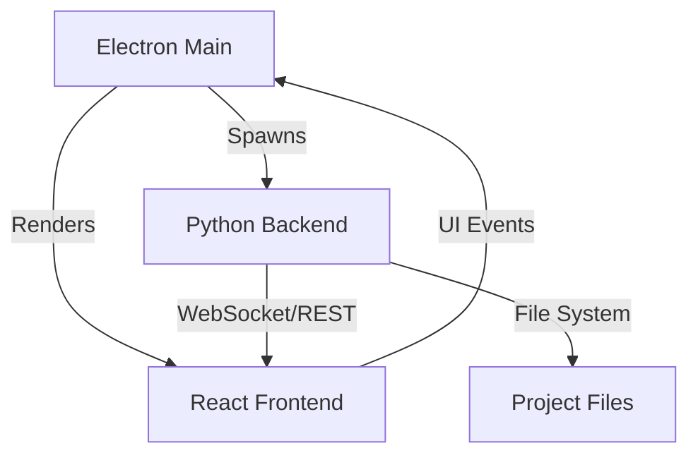

# 🧬 Jenny IDE & Framework

> **The Agentic DX for Python, React, and Electron. Build desktop apps that feel like the future.**

[](LICENSE)
[](https://interchained.org)

Jenny is a high-performance framework and IDE designed to bridge the gap between **Python's backend power** and **React's frontend elegance**, all packaged into a **native Electron shell**.

---

## 🚀 Key Features

*   **⚡ Dual-Stack Excellence**: Seamlessly bundle FastAPI/Uvicorn backends with Vite-powered React frontends.
*   **🤖 Agentic Orchestration**: Integrated process management for AI-driven code surgery and automated workspace scanning.
*   **📦 One-Click Packaging**: Standardized build pipelines that cross-compile Python to standalone executables and pack Electron ASARs.
*   **🎨 Premium DX**: A dark-mode first, glassmorphic IDE experience designed for modern developers.

---

## 🛠️ Getting Started

### Prerequisites
- **Python 3.10+** & **Node.js 18+**

### Create Your First App
```bash
npx jenny create my-cool-app
cd my-cool-app
jenny dev
```

### Production Build & Packaging
```bash
jenny build    # Compiles Python to .exe and bundles React
jenny package  # Wraps everything in a native installer
```

---

## 🗂️ Built-in Templates

Jenny is built to be modular. Every app starts from a **Blueprint**.

*   **`default` (Vite + React + FastAPI)**: The flagship template. Includes a robust state management system, pre-configured TailwindCSS, and a production-ready FastAPI router.
*   **Custom Blueprints**: You can create your own templates in `python/jenny/templates/builtin/` to standardize your company's internal tools.

---

## 🏗️ Project Scaffold

When you run `jenny create`, it generates a clean, enterprise-ready structure:

```text
my-cool-app/
├── 📂 backend/         # Python source (FastAPI)
│   ├── app.py          # Main entrypoint
│   └── requirements.txt
├── 📂 frontend/        # React source (Vite)
│   ├── src/            # UI Components
│   └── vite.config.js
├── 📂 electron/        # Desktop Shell
│   ├── main.js         # Process Manager
│   └── preload.js
└── 📄 jenny.config.json # App Metadata & Build Settings
```

---

## 🔬 Architecture Internals

Jenny uses a unique **process orchestration** model where Electron manages a "Shadow" Python runtime.



- **Backend**: Python 3.11 + FastAPI + Uvicorn
- **Frontend**: React 18 + Vite + TailwindCSS
- **Shell**: Electron 28
- **Orchestration**: Jenny Core Process Manager

---

## 🔐 Licensing (BUSL 1.1)

Jenny is licensed under the **Business Source License 1.1**. 

*   **Source Available**: View, modify, and contribute freely.
*   **Non-Commercial**: Free for internal testing and educational use.
*   **Commercial**: Production/Commercial use requires a license from Interchained LLC.
*   **Open Source Conversion**: Automatically converts to **Apache 2.0** on **2030-01-01**.

For inquiries: [dev@interchained.org](mailto:dev@interchained.org)

---

## 📖 Documentation & Guides

*   🎓 [**Architecture & Internals Deep Dive**](docs/internals.md)

---

<p align="center">Made with 🧬 by <a href="https://interchained.org">Interchained LLC</a></p>