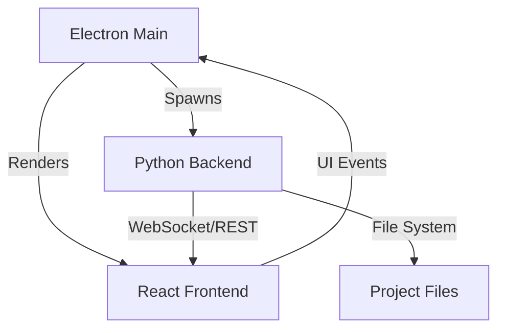

# 🧬 Jenny IDE & Framework

> **The Agentic DX for Python, React, and Electron. Build desktop apps that feel like the future.**

[](LICENSE)
[](https://interchained.org)

Jenny is a high-performance framework and IDE designed to bridge the gap between **Python's backend power** and **React's frontend elegance**, all packaged into a **native Electron shell**.

---

## 🚀 Key Features

*   **⚡ Dual-Stack Excellence**: Seamlessly bundle FastAPI/Uvicorn backends with Vite-powered React frontends.
*   **🤖 Agentic Orchestration**: Integrated process management for AI-driven code surgery and automated workspace scanning.
*   **📦 One-Click Packaging**: Standardized build pipelines that cross-compile Python to standalone executables and pack Electron ASARs.
*   **🎨 Premium DX**: A dark-mode first, glassmorphic IDE experience designed for modern developers.

---

## 🛠️ Getting Started

### Prerequisites

- **Python 3.10+**
- **Node.js 18+**
- **npm / npx**

### Create Your First App

```bash
npx jenny create my-cool-app
cd my-cool-app
jenny dev
```

### Production Build

```bash
jenny build
jenny package
```

---

## 🏗️ Architecture



- **Backend**: Python 3.11 + FastAPI + Uvicorn
- **Frontend**: React 18 + Vite + TailwindCSS
- **Shell**: Electron 28
- **Orchestration**: Jenny Core Process Manager

---

## 🔐 Licensing (BUSL 1.1)

Jenny is licensed under the **Business Source License 1.1**. 

*   **Source Available**: You can view, modify, and contribute to the code.
*   **Non-Commercial Use**: Free for internal testing, educational use, and non-commercial projects.
*   **Commercial Use**: Any production or commercial offering that competes with Interchained LLC requires a license.
*   **Open Source Conversion**: Automatically converts to **Apache 2.0** on **2030-01-01**.

For commercial inquiries: [dev@interchained.org](mailto:dev@interchained.org)

---

## 🎓 Sensi Lessons: Code Signing

Ready to ship to end-users? Don't let Windows SmartScreen block your masterpiece. Learn how to sign your binaries properly without leaking your secrets.

👉 [**The Sensi's Guide to Code Signing**](docs/code-signing.md)

---

<p align="center">Made with 🧬 by <a href="https://interchained.org">Interchained LLC</a></p>
